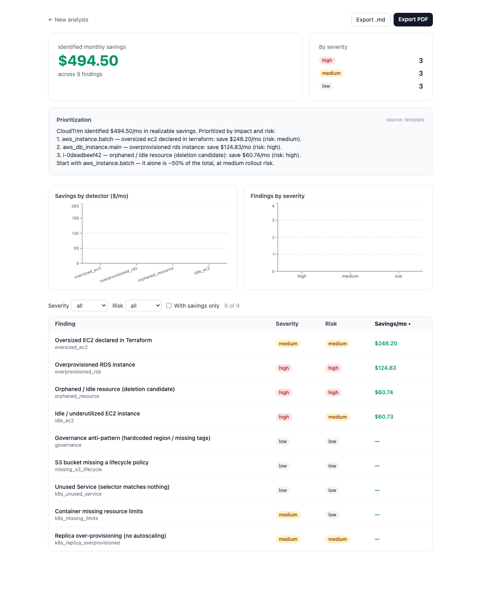
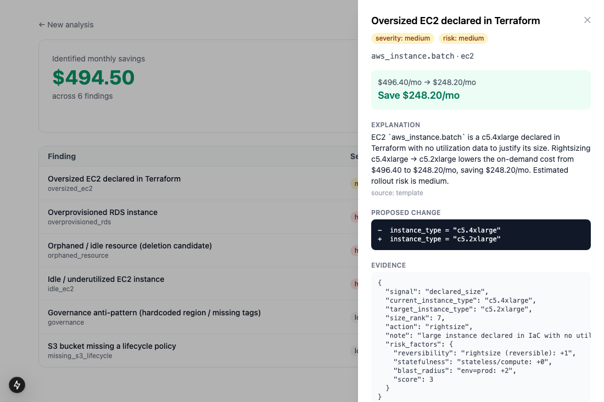

# CloudTrim

> **A shift-left cloud cost optimizer that reviews your Terraform, Kubernetes manifests, and billing data like a senior cloud architect** — detecting waste and anti-patterns with a deterministic engine, pricing the impact against live cloud pricing, and opening explained, risk-scored, ready-to-merge fix PRs in CI.

Not a dashboard. A **reviewer that remediates.**

## The gap it fills

| Existing tools | What they miss |
|---|---|
| Cost Explorer / Compute Optimizer | Show savings, don't execute changes; opaque one-liners; no IaC awareness |
| Kubecost / OpenCost | Allocation/monitoring; terse or zero recommendations |
| CAST AI | Fixes things — but only by taking over your cluster and auto-executing |
| Infracost | Prices a Terraform PR, but tells you the price, not the waste or the fix |

CloudTrim closes three gaps none of them fill together: **reasoning** (explains like an architect), **remediation** (hands you a safe, reviewable fix PR), and **cross-signal correlation** (config + billing + cluster in one model).

## The one law

The **engine is authoritative; the LLM is a narrator.** Parsing, detection, pricing, risk, and remediation are 100% deterministic. The LLM only explains and prioritizes, and its output is validated against engine numbers — it can't hallucinate a dollar figure. See [`docs/adr/0001-deterministic-core-llm-explains.md`](docs/adr/0001-deterministic-core-llm-explains.md).

## Status

🏁 **v1.0 — all six weeks complete.** Terraform **and Kubernetes** + billing → parse → normalize → detect (11 anti-patterns) → price → risk-score → aggregate → explain → prioritize → **remediate**, delivered as a dashboard, exportable reports, and **fix PRs via a GitHub App**, plus **cost anomaly detection + forecast** — production-hardened (auth, rate limiting, JSON logs + request IDs, Prometheus metrics, deploy config + CI/CD). Runs synchronously with zero dependencies, or **async** (Redis/RQ worker + Postgres) when configured.

**What's in:** Terraform (HCL + plan-JSON), **Kubernetes manifest**, and billing parsers · cross-signal normalizer · **11 detectors** (6 AWS/IaC + 5 Kubernetes) · three-tier pricing engine (committed snapshot → disk cache → live AWS Price List **Query API**, [ADR-0002](docs/adr/0002-pricing-snapshot-query-api.md)) · deterministic risk scorer · savings aggregation with per-resource dedupe · **remediation codegen** (validated Terraform/K8s patches) · **cost anomaly detection** (robust median+MAD z-score) + linear forecast · bounded LLM explainer + prioritization narrative + PR description, all **validated on the LLM and template paths** ([ADR-0001](docs/adr/0001-deterministic-core-llm-explains.md)) · Markdown/PDF report export · async job queue (RQ) + Postgres persistence (SQLAlchemy + Alembic) · **GitHub App** (cost-review comments + `/cloudtrim fix` PR, HMAC-verified + idempotent) · **opt-in API-key auth + rate limiting** · **structured JSON logging, request IDs, `/metrics` (Prometheus) + LLM token/cost accounting** · Next.js dashboard (job-status polling, Recharts charts, sort/filter, colored diff drawer, empty/a11y states) · `fly.toml` + GitHub Actions CI/CD (lint · test · eval · build images · gated deploy).

**Eval:** 100% detector precision / 100% recall / 100% savings accuracy across a 3-fixture benchmark (incl. a false-positive guard) — run `make eval`. Deterministic: snapshot pricing + template explainer, no network. Methodology + baseline in [`docs/eval.md`](docs/eval.md).

**Runs with zero keys:** the engine is authoritative and the explainer falls back to a deterministic template, so the demo and CI work with no AWS creds and no LLM key. A key upgrades the prose; it never changes a number.

## Screenshots

Findings dashboard — savings hero, severity breakdown, charts, sortable/filterable findings (AWS + Kubernetes):



Finding-detail drawer — cost delta, architect explanation, proposed HCL change, evidence + risk factors:



## Docs

[Architecture](docs/architecture.md) · [API](docs/api.md) ([OpenAPI](docs/openapi.json)) · [Operations](docs/operations.md) · [GitHub App](docs/github-app.md) · [Eval](docs/eval.md) · ADRs ([0001](docs/adr/0001-deterministic-core-llm-explains.md), [0002](docs/adr/0002-pricing-snapshot-query-api.md)) · [Blueprint](docs/BLUEPRINT.md)

## Quickstart

**API (Python 3.12):**

```bash
make install        # pip install -e ".[dev]"
make test           # pytest
make eval           # score detectors on labeled fixtures (precision/recall)
make run            # uvicorn -> http://localhost:8000/api/v1/healthz
```

**Web (Node):**

```bash
cd apps/web
npm install
npm run dev         # http://localhost:3000
```

Open the web app and click **Load sample data** for an instant demo (no upload,
no keys), or upload your own `.tf` + billing CSV.

**Or via Docker Compose:**

```bash
cp .env.example .env
docker compose up --build   # api :8000, web :3000
```

## Structure

```
apps/{api,worker,web}   # FastAPI edge · async worker (Week 3) · Next.js UI
packages/{engine,ai}    # deterministic engine · bounded LLM layer
eval/                   # labeled fixtures + ground truth + precision/recall harness
infra/  docs/           # deploy manifests · spec, ADRs, architecture
```

## Tech stack

Python + FastAPI · Redis/Celery worker pool (Week 3) · Postgres (Week 3) · Next.js + Tailwind · AWS Price List pricing · LLM/OpenAI (explanation only, validated).
