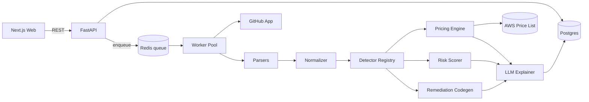

# CloudTrim — Engineering Blueprint

> **Working thesis:** The FinOps market is saturated with *dashboards*. Almost nothing does **shift-left, explainable, remediation-generating** cost optimization that reviews infrastructure *like a senior cloud architect* and hands you the *fix*. That gap is CloudTrim's wedge.

**Author's stance for this doc:** Founding Staff Engineer / Principal Architect. Optimizing for engineering depth, interview discussion value, and resume impact — *not* feature count or a flashy stack. Assumes you build with LLM Code, so implementation speed is not the constraint; **judgment and architecture are.**

---

## 0. Competitive Research & The Gap (why CloudTrim, sharpened)

I researched the nine tools you named. They cluster into four archetypes, and every one of them leaves the same door open.

| Tool | Archetype | What it solves | Key weakness (your opening) |
|---|---|---|---|
| **AWS Cost Explorer** | Native dashboard | Spend visibility, basic rightsizing | Doesn't execute changes; overlooks storage/network; only shows savings ≥ $0; no reasoning |
| **AWS Compute Optimizer** | Native rightsizing | EC2/ASG/EBS rightsizing from CloudWatch | Needs 14 days of metrics; opaque one-liners; no IaC awareness; no fix output |
| **Kubecost** | K8s allocation SaaS | Real-time K8s cost breakdown | IBM-acquisition roadmap uncertainty; monitoring-first; recs are terse |
| **OpenCost** | K8s allocation OSS | Cost allocation to pods/namespaces | **No recommendations at all** — pure allocation; ignores discounts/spot |
| **CAST AI** | K8s autopilot | Auto bin-packing, spot, autoscaling | Black-box; requires cluster takeover; auto-executes (risky); closed |
| **Harness CCM** | Enterprise FinOps | AutoStopping, commitments, anomaly | Heavy enterprise product; opaque recs; not shift-left |
| **Finout** | FinOps SaaS | Virtual-tag allocation, MegaBill | Allocation/visibility, not IaC remediation |
| **Vantage** | FinOps SaaS | Cost dashboards, Autopilot commitments | Depends on good tagging; reporting-first |
| **Infracost** | Shift-left | Cost **diff** of a Terraform PR | **Tells you the price, not the waste or the fix**; ASG uses min instances only; no anti-pattern detection; no reasoning |

**The three gaps nobody fills well:**

1. **Reasoning gap.** Every tool emits terse recommendations ("downsize to t3.small"). None *explain like an architect* — why, what's the risk, what's the blast radius, how to roll back. That's exactly what an LLM is uniquely good at, *if grounded on deterministic evidence.*
2. **Remediation gap.** They tell you *what* is wrong; almost none hand you the *fix*. Infracost prices your PR but won't rewrite your `.tf`. CAST AI fixes things but only by taking over your cluster and auto-executing. **Nobody generates a safe, reviewable fix PR from static IaC.**
3. **Cross-signal gap.** Billing tools see the bill. IaC tools see the config. K8s tools see the cluster. **None correlate all three** — e.g., "Terraform declares `t3.large`, the bill shows 8% CPU, so here's the corrected HCL and the $/mo you save."

### CloudTrim's positioning (one sentence)
> **CloudTrim is a shift-left cloud cost optimizer that reviews your Terraform, Kubernetes manifests, and billing data like a senior cloud architect — detecting waste and anti-patterns with a deterministic engine, pricing the impact against live cloud pricing, and opening explained, risk-scored, ready-to-merge fix PRs in CI.**

Not a dashboard. A **reviewer that remediates.** Infracost's shift-left placement + Compute Optimizer's rightsizing depth + an architect's reasoning + an actual code fix — a combination none of them ship.

### Is CloudTrim the highest-ROI flagship? Yes — with one honest caveat.
For a new-grad resume targeting Google/Meta/Amazon/Stripe/Databricks/etc., CloudTrim beats the alternatives because it forces you to demonstrate **backend, API design, async/distributed processing, cloud, DevOps/CI, system design, and bounded AI integration** on a problem with an *unavoidable business metric* (dollars). The caveat: **do not overclaim "distributed systems."** What you'll truthfully build is an async job-queue + worker-pool + caching architecture. That's real and interview-worthy — claim exactly that, not "planet-scale distributed systems."

---

## 1. Product Vision

**Problem.** Cloud waste is enormous and structural: teams routinely run infrastructure at <15% utilization, ship Terraform with oversized instances and no lifecycle policies, and deploy Kubernetes workloads with no resource limits or autoscaling. Existing tools surface the *symptom* (a high bill) *after* money is spent, in opaque dashboards, without telling engineers what to change or why. Waste is caught late, explained poorly, and rarely fixed.

**Target users.** Platform / DevOps / SRE engineers and the FinOps-curious backend engineers who own IaC. Secondary: engineering managers who want cost hygiene enforced in code review, not in a quarterly finance meeting.

**Value proposition.** Catch cost problems *at PR time*, get an *architect-grade explanation* of each issue, and receive a *ready-to-merge fix* — with the dollar impact and rollback risk attached. Shift FinOps left, from finance's spreadsheet into the engineer's pull request.

**Why companies would use it.** It turns cost optimization into a code-review gate (like linting or security scanning), which is where engineering orgs already have muscle memory. It's explainable and safe (suggests PRs, never auto-executes), and self-hostable (unlike CAST AI's cluster takeover).

**Competitive differentiation.** Shift-left + reasoning + remediation + cross-signal correlation, with a hard architectural boundary: **a deterministic engine computes every number; the LLM only explains and prioritizes.** That boundary is both the product's trust story and your best interview talking point.

---

## 2. MVP (3–5 Days) — already resume-worthy

**Scope discipline:** one surface, end-to-end, done well. Terraform + billing CSV → detected findings → deterministic savings → LLM explanation → clean dashboard. **No** Kubernetes, **no** GitHub bot, **no** live AWS API yet (those are Weeks 3–4).

**Features**
- Upload a Terraform file (or `terraform show -json` plan) **and** a billing/utilization CSV.
- Deterministic detection of 5–6 high-value anti-patterns (below).
- Live-priced savings estimate per finding (AWS Price List API, cached).
- Deterministic risk score (Low/Med/High).
- LLM-written, architect-voice explanation per finding (grounded on the finding's structured evidence — **numbers come from the engine, never the model**).
- Dashboard: total monthly savings, findings table, per-finding detail with reasoning.

**Initial detectors (MVP)**
1. Idle/underutilized EC2 (utilization < threshold → rightsize to smaller family member)
2. Overprovisioned RDS (low utilization → smaller instance class)
3. Missing S3 lifecycle policy (no transition/expiration rules on a bucket with old data)
4. Oversized EC2 in Terraform (instance type vs workload signal)
5. Hardcoded region / missing tags (governance anti-pattern)
6. Orphaned/idle resource (in config or bill, zero recent usage → deletion candidate)

**APIs (FastAPI, versioned `/api/v1`)**
```
POST /api/v1/analyses            # multipart upload (tf + csv) -> {analysis_id}
GET  /api/v1/analyses/{id}       # status + summary (total savings, counts by severity)
GET  /api/v1/analyses/{id}/findings   # list of findings with evidence + explanation
GET  /api/v1/findings/{id}       # single finding detail (evidence, diff, reasoning, risk)
GET  /api/v1/healthz             # liveness
```

**AI functionality (MVP).** A single `explain_finding()` call: structured finding in → grounded architect explanation out, using structured output + a validation step that rejects any explanation whose dollar figure doesn't match the engine. Retry/fallback wrapper (reuse your CineMind reliability pattern).

**Data model (MVP)**
```
Analysis(id, created_at, status, source_meta, total_monthly_savings)
Resource(id, analysis_id, type, provider, region, identifier, monthly_cost, utilization, raw)
Finding(id, analysis_id, resource_id, detector, severity, risk, current_cost,
        projected_cost, monthly_savings, evidence_json, remediation_diff, explanation, confidence)
```

**UI (Next.js)**
- `/` upload page (drag-drop tf + csv), sample-data button for instant demo.
- `/analyses/[id]` dashboard: hero savings number, severity breakdown, sortable findings table.
- Finding detail drawer: evidence, the proposed change, risk badge, architect explanation.

**Why the MVP alone is resume-worthy:** it already shows a deterministic analysis engine, live pricing integration, a bounded-AI design with output validation, a clean REST API, and a React dashboard. That's a real system, not a wrapper.

---

## 3. Six-Week Roadmap

> Legend: each week is scoped to be a few focused sessions with LLM Code, not full-time weeks. Every week ends shippable.

### Week 1 — Core engine + MVP
**Objective:** deterministic Terraform + billing analysis with priced findings and a dashboard.

**Backend**
- [x] FastAPI skeleton, `/api/v1` router, health check, settings via env
- [x] Terraform parser (`terraform show -json` primary, `python-hcl2` fallback) → normalized `Resource`
- [x] Billing CSV parser → `Resource` cost/utilization enrichment
- [x] `Normalizer` merging config + billing into a unified ResourceModel (join by id/tags)
- [x] Detector interface + 6 MVP detectors in a registry
- [x] Pricing engine v1 (AWS Price List bulk JSON, cached) → savings math

**Frontend**
- [x] Upload page + sample-data demo mode
- [x] Findings dashboard (savings hero, severity breakdown, table)
- [x] Finding detail drawer

**AI**
- [x] `explain_finding()` grounded call + output validation (numbers must match engine)
- [x] Retry/fallback + response cache

**Infrastructure**
- [x] Local run via Docker Compose (api + web); `.env.example`

**Testing**
- [x] Unit tests for each detector against fixture inputs
- [x] Pricing engine tests (known instance → known price)

**Documentation**
- [x] README quickstart + sample data
- [x] `docs/adr/0001-deterministic-core-llm-explains.md`

**Deployment**
- [x] Runs locally with one command

**Resume improvement:** *"Built a deterministic cloud-cost analysis engine that parses Terraform and billing data, detects six classes of infrastructure waste, and prices remediation savings against the live AWS Price List API."*

**Skills learned:** IaC parsing, normalized data modeling, rules-engine design, cloud pricing APIs, grounded LLM output with validation.

---

### Week 2 — Reasoning, risk, reports, eval harness
**Objective:** make the output trustworthy and shippable as a report.

**Backend**
- [x] Deterministic risk scorer (blast radius, statefulness, reversibility, env-from-tags)
- [x] Savings summary aggregation endpoint
- [x] Report export (Markdown + PDF)

**Frontend**
- [x] Risk badges + sorting/filtering by severity, risk, savings
- [x] "Export report" action

**AI**
- [x] Architect-voice prioritization narrative for the whole analysis (top opportunities)
- [x] Prompt regression tests (golden outputs)

**Infrastructure**
- [x] Config for pricing snapshot caching

**Testing**
- [x] **Eval harness v1**: benchmark repo of known-waste fixtures with ground-truth findings; measure detector **precision/recall** and pricing accuracy
- [x] CI runs unit + eval on every push

**Documentation**
- [x] `docs/eval.md` explaining metrics + baseline numbers

**Deployment**
- [x] Dockerfile for api + worker image

**Resume improvement:** *"Designed a deterministic risk-scoring model and an offline eval harness measuring recommendation precision/recall on a labeled benchmark, keeping the LLM strictly to explanation (numbers validated against the engine)."*

**Skills learned:** evaluation methodology, risk modeling, report generation, prompt regression testing.

---

### Week 3 — Kubernetes + async job architecture + persistence
**Objective:** add a second signal and make analysis scale asynchronously.

**Backend**
- [x] Kubernetes manifest parser (PyYAML) → workload model (requests/limits, replicas, HPA)
- [x] K8s detectors: missing CPU/mem limits, over-request vs usage, replica over-provisioning, missing HPA, unused Service
- [x] **Async job queue** (Redis + RQ/Celery) + worker pool; analyses run as idempotent, retryable jobs
- [x] Postgres persistence (Analyses/Resources/Findings) + migrations (Alembic)
- [x] Historical trend endpoint (savings over time)

**Frontend**
- [x] Job status/progress UI (queued → running → done)
- [x] Charts (savings by service, findings by type) with Recharts

**AI**
- [x] Explanations extended to K8s findings

**Infrastructure**
- [x] Compose adds redis + postgres + worker

**Testing**
- [x] K8s detector unit tests; job-queue integration test (enqueue → process → persist)

**Documentation**
- [x] Architecture doc updated with the async pipeline

**Deployment**
- [x] Seeded demo database

**Resume improvement:** *"Re-architected analysis into an asynchronous job queue with a worker pool (Redis + Celery) and Postgres persistence, adding a Kubernetes manifest scanner with five workload detectors."*

**Skills learned:** async job processing, worker pools, idempotency/retries, relational persistence + migrations, YAML/K8s modeling.

---

### Week 4 — GitHub PR bot + remediation codegen (the differentiator)
**Objective:** ship the shift-left superpower — fixes as PRs.

**Backend**
- [x] Remediation generator: emit corrected Terraform diff per IaC finding (and patched YAML for K8s)
- [x] GitHub App/webhook: on PR touching `.tf`, analyze the diff and post a cost + waste comment
- [x] "Open fix PR" action: bot commits the remediation to a branch and opens a PR
- [x] Signature verification + webhook idempotency

**Frontend**
- [x] Diff viewer per finding (before/after HCL)
- [x] "Connect a repo" flow (or a mocked repo demo)

**AI**
- [x] LLM writes the PR description/rationale (grounded on the deterministic diff + savings)

**Infrastructure**
- [x] Secrets handling for GitHub App creds

**Testing**
- [x] Codegen produces valid, `terraform validate`-passing HCL on fixtures
- [x] Webhook handler tests (signature, idempotency)

**Documentation**
- [x] `docs/github-app.md` setup guide

**Deployment**
- [x] Webhook endpoint deployed/publicly reachable (or ngrok for demo)

**Resume improvement:** *"Built a GitHub App that reviews Terraform pull requests, comments architect-grade cost analysis, and opens ready-to-merge fix PRs with validated HCL codegen — shifting FinOps into code review."*

**Skills learned:** webhooks + signature verification, GitHub App auth, code generation, idempotent event handling.

---

### Week 5 — Production hardening + deploy + CI/CD
**Objective:** make it look and behave like production software.

**Backend**
- [ ] AuthN (API keys / OAuth), rate limiting, input validation + size limits
- [ ] Structured logging (JSON), request IDs, error taxonomy
- [ ] Metrics endpoint (Prometheus-style counters/latency)
- [ ] Caching layer (pricing + LLM) with TTLs

**Frontend**
- [ ] Loading/error states, empty states, accessibility pass

**AI**
- [ ] Token/cost accounting + guardrail on prompt size

**Infrastructure**
- [ ] Full Docker Compose (api, worker, web, redis, postgres)
- [ ] Deploy to Fly.io / Render / AWS ECS
- [ ] **GitHub Actions CI/CD**: lint, test, eval, build images, deploy

**Testing**
- [ ] Integration/e2e happy-path; load smoke test on the queue

**Documentation**
- [ ] `docs/operations.md` (runbook, config, scaling notes)

**Deployment**
- [ ] Public demo URL

**Resume improvement:** *"Hardened for production: auth, rate limiting, structured logging, Prometheus metrics, Redis caching, containerized with Docker Compose, and a GitHub Actions pipeline running lint/test/eval and deploying on merge."*

**Skills learned:** observability, rate limiting, CI/CD, containerization, deployment.

---

### Week 6 — Polish, docs, one stretch feature, interview packaging
**Objective:** make it demo-perfect and interview-ready.

**Backend**
- [ ] Pick **one** stretch: (a) cost anomaly detection on historical CUR, (b) next-month forecast, or (c) live AWS **read-only** connector (Cost Explorer/CUR)

**Frontend**
- [ ] Polished landing + demo walkthrough, seeded "wow" dataset

**AI**
- [ ] Optional: agentic "investigate this resource" multi-step mode (stretch)

**Infrastructure**
- [ ] Architecture diagram(s) in repo

**Testing**
- [ ] Final eval run; publish precision/recall + savings-accuracy numbers in README

**Documentation**
- [ ] Full README, API docs (OpenAPI), architecture docs, ADRs, demo video/GIF
- [ ] `docs/interview-notes.md` (your own talking points)

**Deployment**
- [ ] Tagged v1.0 release

**Resume improvement (final headline bullet):** *"CloudTrim — a shift-left cloud cost optimizer that analyzes Terraform, Kubernetes, and billing data with a deterministic engine, prices savings against live AWS pricing, risk-scores changes, and opens explained fix PRs; async worker architecture, GitHub App integration, eval harness (P/R reported), full CI/CD."*

**Skills learned:** anomaly detection or forecasting, technical writing, product packaging.

---

## 4. Architecture

### High-level (request → analysis → remediation)
```
                         ┌─────────────────────────────────────────────┐
                         │                Next.js Web                   │
                         │  Upload · Dashboard · Finding detail · Diffs │
                         └───────────────┬─────────────────────────────┘
                                         │ REST /api/v1
                         ┌───────────────▼─────────────────────────────┐
                         │              FastAPI  (API layer)            │
                         │  auth · validation · rate limit · routing    │
                         └───────┬───────────────────────┬─────────────┘
                                 │ enqueue job            │ read
                         ┌───────▼────────┐        ┌──────▼──────────┐
                         │ Redis (queue + │        │  Postgres       │
                         │ cache)         │        │  analyses/      │
                         └───────┬────────┘        │  resources/     │
                                 │ dequeue         │  findings       │
                         ┌───────▼────────────────────────────────────┐
                         │            Worker Pool (Celery/RQ)          │
                         │                                             │
                         │  ┌──────────┐  ┌───────────┐  ┌──────────┐  │
                         │  │ Parsers  │─▶│ Normalizer│─▶│ Detector │  │
                         │  │ tf/k8s/  │  │ unified   │  │ registry │  │
                         │  │ billing  │  │ Resource  │  │ (rules)  │  │
                         │  └──────────┘  └───────────┘  └────┬─────┘  │
                         │                                    │Findings│
                         │  ┌──────────┐  ┌───────────┐  ┌────▼─────┐  │
                         │  │ Pricing  │  │ Risk       │  │Remediation│ │
                         │  │ engine   │  │ scorer     │  │ codegen   │ │
                         │  │(det. $)  │  │ (det.)     │  │(HCL/YAML) │ │
                         │  └────┬─────┘  └─────┬──────┘  └────┬─────┘  │
                         │       └──────┬───────┴──────────────┘        │
                         │        ┌─────▼──────────────┐                │
                         │        │ LLM Explainer      │  (grounded,    │
                         │        │ validates $ vs eng.│   retry/fallbk)│
                         │        └────────────────────┘                │
                         └───────┬─────────────────────────────────────┘
                                 │
                  ┌──────────────▼───────────────┐     ┌──────────────────────┐
                  │ AWS Price List API (cached)  │     │ GitHub App (webhook)  │
                  │ + optional CUR read-only     │     │ PR comment + fix PR   │
                  └──────────────────────────────┘     └──────────────────────┘
```

### Component responsibilities
- **Web (Next.js):** upload, dashboards, finding detail, diff viewer. Stateless; talks only to the API.
- **API (FastAPI):** thin edge — auth, validation, rate limiting, enqueues jobs, serves reads. No heavy compute in the request path.
- **Redis:** job broker + result cache + pricing/LLM cache.
- **Worker pool:** where analysis actually happens; idempotent, retryable jobs. This is your "distributed processing" story (bounded and honest).
- **Parsers:** deterministic, source-specific (Terraform plan JSON / HCL, K8s YAML, billing CSV/CUR).
- **Normalizer:** merges all sources into one `Resource` model keyed by identifier/tags — the cross-signal magic.
- **Detector registry:** pluggable rules; each detector is independently testable and emits a `Finding` + candidate remediation.
- **Pricing engine (deterministic):** the single source of truth for every dollar figure.
- **Risk scorer (deterministic):** blast radius, statefulness, reversibility, environment.
- **Remediation codegen:** produces valid HCL/YAML diffs (`terraform validate`-checked).
- **LLM explainer:** narrates + prioritizes; **validated** against engine numbers; never authoritative on math.
- **GitHub App:** the shift-left delivery channel.

### Mermaid (for repo docs)


---

## 5. Technology Choices

| Layer | Choice | Why | Alternatives & trade-off |
|---|---|---|---|
| Backend | **Python + FastAPI** | The parsing/cloud ecosystem (hcl2, boto3, kubernetes, PyYAML) is Python-native; async support; fast iteration with LLM Code | **Go** gives stronger concurrency + infra credibility, but weaker IaC-parsing libs and slower iteration. Trade velocity for cred — note in interviews you'd pick Go for a high-throughput rewrite of the workers. |
| Job queue | **Redis + Celery (or RQ)** | Simple, battle-tested, easy local dev; gives you real async/worker-pool talking points | **SQS/Cloud Tasks** (managed, but ties you to a cloud); **Kafka** (overkill). RQ is simpler than Celery — pick RQ if you want less config. |
| Database | **Postgres** (JSONB for evidence) | Relational for analyses/resources/findings + flexible JSON for heterogeneous evidence | **SQLite** for a local-first demo (simpler, less "prod"); **Mongo** (loses relational joins you want). |
| Cache | **Redis** | Reuse the broker; cache pricing + LLM responses (cost + latency) | In-proc LRU (doesn't survive restarts / multi-worker). |
| LLM | **LLM / OpenAI via API**, structured outputs | Explanation quality; structured output enables validation | Local model (Ollama) as fallback for a privacy story; trade quality for control. |
| Pricing | **AWS Price List (bulk JSON), cached** | Deterministic, offline-capable, no account needed for demo | Live Cost Explorer/CUR (accurate but needs a real account + spend). |
| IaC parse | **`terraform show -json` plan** (primary) + `python-hcl2` (fallback) | Plan JSON is the accurate, resolved view; HCL fallback handles raw files | Regex parsing (fragile — avoid). |
| Frontend | **Next.js + React + Tailwind + Recharts** | Reuse your CineMind stack; fast, familiar, good charts | Plain React/Vite (fine, less batteries-included). |
| Infra | **Docker Compose** → Fly.io/Render/ECS; **GitHub Actions** CI/CD | Portable local prod; simple deploy; standard pipeline | k8s for deploy (overkill for a portfolio deployment; mention as scaling path). |

**Guiding principle:** every choice favors *velocity + credible depth* over novelty. When a "cooler" option exists (Go, Kafka, k8s), you keep it as an articulate *trade-off answer* rather than a build cost.

---

## 6. AI Architecture — where AI earns its place

**Design law:** *The engine is authoritative. The model is a narrator.* If the LLM disappeared, CloudTrim would still produce correct findings and correct dollar figures — it would just be less pleasant to read. That's the test of non-wrapper AI.

**Deterministic (no LLM):**
- Parsing, normalization, cross-signal joins
- Detection rules (all anti-patterns)
- Pricing + savings math
- Risk scoring
- Remediation codegen (HCL/YAML)
- Dedup / resource resolution

**Rule-based:**
- The detector registry (clear, testable, reproducible business logic)

**LLM (bounded, additive):**
- Architect-voice **explanation** of each finding, grounded on structured evidence
- **Prioritization narrative** across the whole analysis ("fix these three first, here's why")
- **PR description** generation from the deterministic diff
- Natural-language **Q&A** over findings ("why is downsizing this RDS risky?")
- *Stretch:* agentic multi-step **investigation** of an ambiguous resource; fuzzy anti-pattern detection where rules are brittle

**Guardrails (the interview gold):**
- Structured output schema; the explanation must reference only resources/numbers present in the finding.
- **Validation step:** parse the LLM's cited dollar figure and reject/regenerate if it doesn't equal the engine's number.
- Retry with backoff + model fallback; response caching keyed on finding hash.
- Token/size guardrails; prompt-regression golden tests.

**Why this matters:** "I used AI, but I put it behind a deterministic engine and validated its outputs so it can't hallucinate a savings number" is exactly the kind of judgment senior interviewers probe for. It's the opposite of a wrapper.

---

## 7. Resume Impact (cumulative, truthful by end of each week)

- **After Wk 1:** deterministic multi-source analysis engine + live pricing + grounded AI explanation + REST API + React dashboard.
- **After Wk 2:** risk model + offline eval harness with precision/recall + report export.
- **After Wk 3:** async worker architecture (Redis/Celery) + Postgres + Kubernetes scanner.
- **After Wk 4:** GitHub App that reviews PRs and opens validated fix PRs (the headline differentiator).
- **After Wk 5:** production hardening — auth, rate limiting, observability, caching, Docker, CI/CD, deployed.
- **After Wk 6:** anomaly detection *or* forecasting *or* live AWS connector + full docs + published eval numbers.

**Final three-bullet resume block (target):**
```
CloudTrim — AI Cloud Cost Optimization Platform
• Built a shift-left cloud cost optimizer that analyzes Terraform, Kubernetes manifests, and
  billing data with a deterministic rules+pricing engine, detecting ~15 classes of waste and
  pricing savings against the live AWS Price List API; LLM layer explains and prioritizes with
  outputs validated against the engine (no hallucinated figures).
• Engineered an asynchronous analysis pipeline (FastAPI + Redis/Celery worker pool + Postgres)
  and a GitHub App that reviews pull requests and opens ready-to-merge, terraform-validate'd
  fix PRs — with risk scoring and rollback guidance.
• Shipped production-grade: auth, rate limiting, structured logging + metrics, Redis caching,
  Docker Compose, and GitHub Actions CI/CD running an eval harness that reports recommendation
  precision/recall on a labeled benchmark.
```

---

## 8. GitHub Plan

**Repository structure (monorepo)**
```
cloudtrim/
├── README.md
├── docker-compose.yml
├── .github/
│   ├── workflows/ci.yml            # lint, test, eval, build, deploy
│   └── ISSUE_TEMPLATE/
├── apps/
│   ├── api/                        # FastAPI edge
│   ├── worker/                     # Celery/RQ jobs
│   └── web/                        # Next.js
├── packages/
│   ├── engine/                     # parsers, normalizer, detectors, pricing, risk, codegen
│   │   ├── parsers/                # terraform.py, k8s.py, billing.py
│   │   ├── detectors/              # one file per detector + registry.py
│   │   ├── pricing/                # price_list client + cache
│   │   ├── risk/                   # scorer
│   │   └── remediation/            # hcl_codegen.py, yaml_patch.py
│   └── ai/                         # explainer, prompts, validation, retry/fallback
├── eval/
│   ├── fixtures/                   # labeled known-waste tf/k8s/csv
│   ├── ground_truth/
│   └── run_eval.py                 # precision/recall + pricing accuracy
├── infra/                          # deploy manifests / compose overrides
└── docs/
    ├── architecture.md
    ├── api.md                      # generated from OpenAPI
    ├── eval.md
    ├── github-app.md
    ├── operations.md
    └── adr/                        # 0001-deterministic-core.md, ...
```

**README outline:** one-line pitch → demo GIF → the problem → how it's different (the gap table) → architecture diagram → quickstart (sample data) → eval numbers → tech stack → roadmap → design decisions (link ADRs).

**Docs:** `architecture.md` (diagrams + component responsibilities), `api.md` (OpenAPI export), `eval.md` (methodology + numbers), ADRs for the big calls (deterministic core, async queue, plan-JSON parsing).

**GitHub Issues:** label taxonomy — `area:engine`, `area:api`, `area:web`, `area:ai`, `area:infra`, `type:feat`, `type:bug`, `type:docs`, `good-first-issue`. Convert each roadmap checkbox into an issue.

**GitHub Projects board:** columns `Backlog → This Week → In Progress → Review → Done`; one card per issue; link to milestones.

**Milestones:** `M1 MVP`, `M2 Reasoning+Eval`, `M3 K8s+Async`, `M4 GitHub App`, `M5 Prod`, `M6 Polish` — mapped 1:1 to the six weeks.

---

## 9. Interview Preparation

| Feature you built | Interview questions it prepares you for | System design concepts | Backend concepts |
|---|---|---|---|
| Async job queue + workers | "Design a system that processes uploaded files / long-running jobs" | Queues, back-pressure, worker pools, idempotency, retries, at-least-once delivery | Task decomposition, concurrency, failure handling |
| Deterministic engine + LLM boundary | "How do you use LLMs reliably?" / "How do you prevent hallucination?" | Trust boundaries, validation, graceful degradation | Output validation, schema enforcement, caching |
| Pricing engine + cache | "Design a rate-limited external-API integration" | Caching strategies, TTLs, cache invalidation, external-dependency isolation | HTTP clients, retries, memoization |
| Detector registry | "Design an extensible rules/plugins system" | Strategy pattern, open/closed extensibility, pipeline design | Interfaces, registries, testability |
| Normalizer / cross-signal join | "Reconcile data from multiple heterogeneous sources" | Canonical data models, entity resolution, joins | Schema design, data modeling |
| GitHub App + webhooks | "Design a webhook receiver / CI integration" | Event-driven ingestion, signature verification, idempotency keys, replay safety | Auth (app tokens), HMAC verification |
| Postgres data model | "Design the schema for X" | Normalization vs JSONB, indexing, time-series trends | Migrations, transactions |
| Eval harness | "How do you know your system is correct?" | Offline evaluation, metrics, regression prevention | Test design, fixtures, CI gating |
| Observability + rate limiting | "Make this production-ready" | SLIs/SLOs, structured logging, metrics, throttling | Middleware, error taxonomy |

**Your one-paragraph pitch (memorize):** *"CloudTrim reviews infrastructure like a senior cloud architect. It parses Terraform, Kubernetes, and billing into one normalized model, runs a registry of deterministic detectors, prices every recommendation against live AWS pricing, scores rollout risk, and generates a validated fix PR. The LLM only explains and prioritizes — every number is computed by the engine and the model's output is validated against it, so it can't hallucinate savings. It runs async on a worker pool and ships as a GitHub App so cost review happens in the PR, not the quarterly finance review."*

---

## 10. Stretch Features (only after the core is solid)

1. **Cost anomaly detection** — statistical/seasonal baseline on historical CUR; flag spikes with likely-cause attribution.
2. **Next-month forecast** — trend + commitment-aware projection of the bill.
3. **Multi-cloud** — add GCP/Azure parsers + pricing; the normalizer already abstracts provider.
4. **Slack integration** — push high-value findings / anomalies to a channel.
5. **Deeper GitHub** — policy gates ("block PRs that add >$X/mo without approval").
6. **Live AWS read-only connector** — real Cost Explorer/CUR + CloudWatch utilization (moves you from "sample data" to "real account").
7. **Kubernetes live mode** — read from a cluster (OpenCost-style allocation) instead of static manifests.
8. **Agentic investigator** — multi-step LLM agent that pulls extra evidence and reasons about a specific resource (reuses your CineMind multi-agent muscle, now grounded).
9. **FinOps dashboard** — org-level trends, savings realized vs identified, ownership by tag.

> Sequence: land #6 or #1 first (they most increase realism and interview surface), keep the rest as "what's next" talking points.

---

## Appendix — First Principles / Anti-patterns to avoid
- **Don't let the LLM compute money.** Ever. Engine computes; model narrates; validation enforces.
- **Don't build three shallow scanners.** Go deep on Terraform + billing first; K8s second; breadth is a Week-3 problem, not a Day-1 one.
- **Don't overclaim.** "Async worker pool + caching," not "distributed systems at scale." Precision reads as senior.
- **Don't skip the eval harness.** It's your credibility and a differentiator — the same move that made CineMind believable.
- **Don't ship a dashboard.** The market is dashboards. Ship a *reviewer that remediates.*
