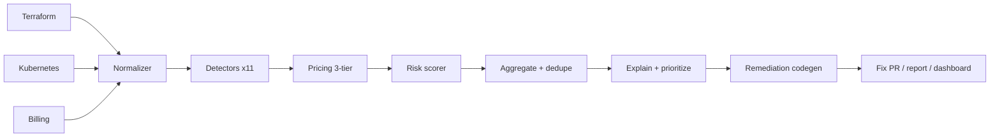
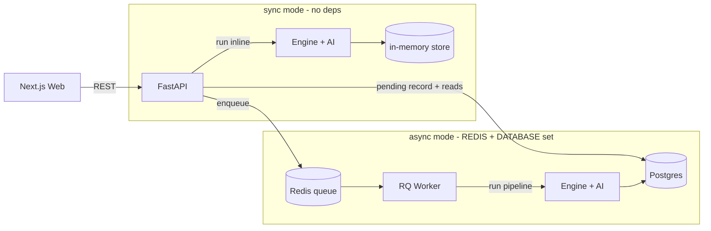

# Architecture

How CloudTrim is put together, and how a request flows through it. See
[`BLUEPRINT.md`](BLUEPRINT.md) §4 for the original design and the ADRs for the two
load-bearing decisions ([0001](adr/0001-deterministic-core-llm-explains.md) the
deterministic core, [0002](adr/0002-pricing-snapshot-query-api.md) pricing).

## The one law

The **engine is authoritative; the LLM is a narrator.** Parsing, normalization,
detection, pricing, risk scoring, and aggregation are 100% deterministic and live in
`packages/engine`. The `packages/ai` layer only explains and prioritizes, and its
output is validated against the engine's numbers on both the LLM and template
paths. If the LLM disappeared, every finding and every dollar figure would be
unchanged.

## Components

| Layer | Package | Responsibility |
|---|---|---|
| Web | `apps/web` | Next.js dashboard — upload, savings hero, charts, sortable/filterable findings, detail drawer, report export. Talks only to the API. |
| API | `apps/api` | FastAPI edge — validation, CORS, enqueues jobs (async) or runs the engine in-request (sync), serves reads, report/narrative/trend endpoints. |
| Worker | `apps/worker` | RQ job consumer — runs the pipeline and persists (async path). Idempotent, retryable. |
| Engine | `packages/engine` | Deterministic core: parsers (Terraform, Kubernetes, billing) → normalizer → detectors → pricing → risk → aggregate. |
| AI | `packages/ai` | Bounded LLM: `explain_finding` + `prioritize_analysis`, validated, with a deterministic template fallback. |
| Store | `apps/api/api/{store,db}` | In-memory by default; SQLAlchemy/Postgres when `CLOUDTRIM_DATABASE_URL` is set. |

## The analysis pipeline (deterministic)

```
parse (tf / k8s / billing) → normalize (cross-signal join) → detect (11 detectors)
  → price (3-tier) → risk-score → aggregate (dedupe) → explain (bounded LLM)
```



Two signals feed one model: Terraform/K8s config (what's declared) and billing
(what it costs and how it's used), joined by identifier/tags in the normalizer.

## Dual-mode execution

The same pipeline runs two ways, chosen by configuration — a deliberate consequence
of the determinism principle (the demo/CI path must not depend on live services):



- **Sync mode** (neither `CLOUDTRIM_REDIS_URL` nor `CLOUDTRIM_DATABASE_URL` set):
  `POST /analyses` runs the engine in-request and stores the result in memory. This
  is the zero-dependency demo and the test/CI path.
- **Async mode** (both set): `POST /analyses` writes a **pending** record to
  Postgres, enqueues an RQ job, and returns immediately. The worker runs the
  pipeline and persists the completed analysis; the web dashboard polls
  `GET /analyses/{id}` (queued → running → complete). Jobs are **idempotent**
  (keyed on a pre-assigned id + a replacing `save`) and **retryable** (RQ `Retry`).

`docker compose up` brings up api + worker + redis + postgres and runs async;
`make run` runs sync.

## Determinism boundaries (the test tiers)

Every external dependency has a deterministic tier used by tests/eval/CI and a live
tier gated on credentials — see [[deterministic-offline-path]]:

| Dependency | Deterministic tier (tests/eval/demo) | Live tier |
|---|---|---|
| Pricing | committed `snapshot.json` | AWS Price List Query API (boto3) |
| LLM | template explainer | the LLM (`CLOUDTRIM_LLM_API_KEY`) |
| Database | SQLite | Postgres (`CLOUDTRIM_DATABASE_URL`) |
| Queue | fakeredis + RQ sync mode | Redis + RQ worker |

## Persistence

`Analyses / Resources / Findings` tables (SQLAlchemy, `apps/api/api/db`). Portable
JSON columns hold heterogeneous data (`source_meta`, the aggregate, resource `raw`,
finding `evidence`) — JSONB in production, JSON for the SQLite test tier. Schema is
managed by Alembic (`migrations/`); `GET /api/v1/trends` reads savings over time.
